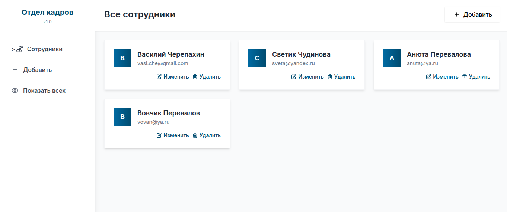
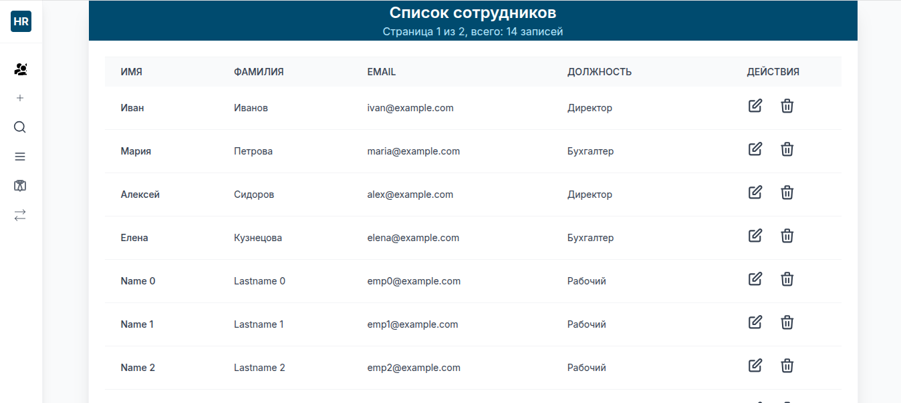
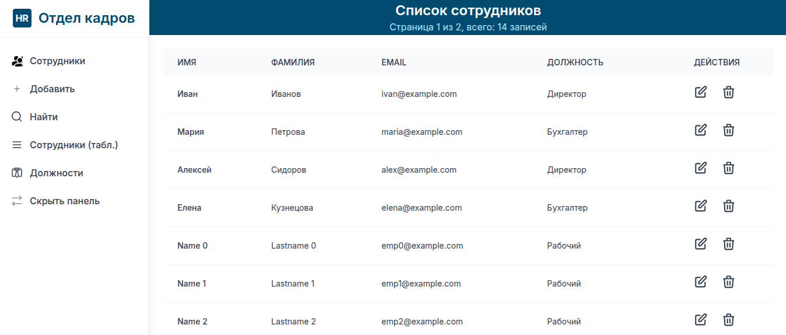
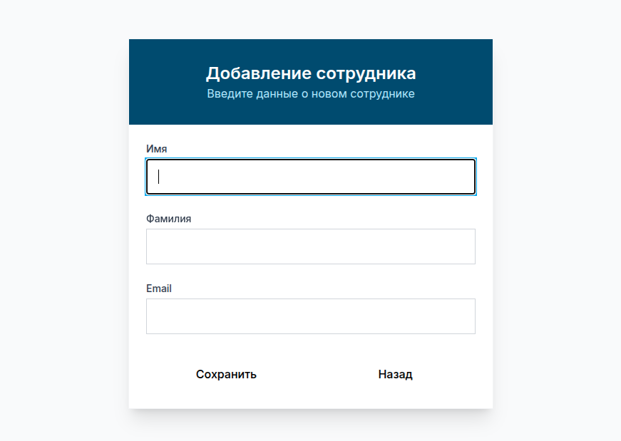
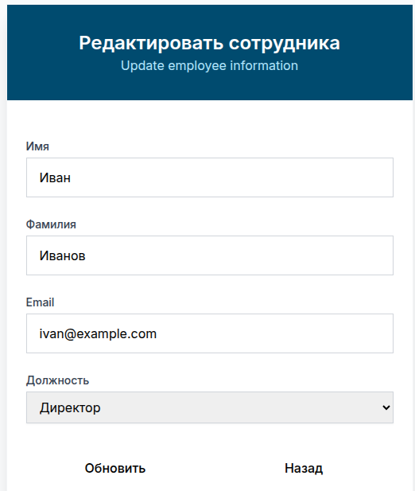
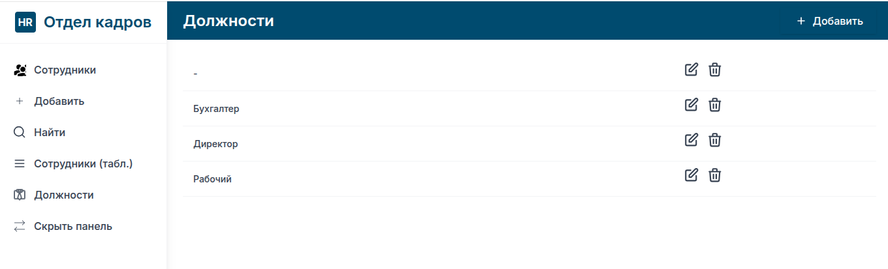
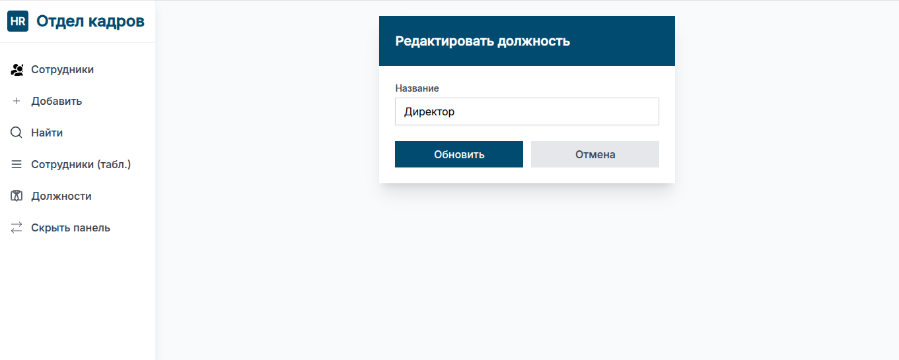
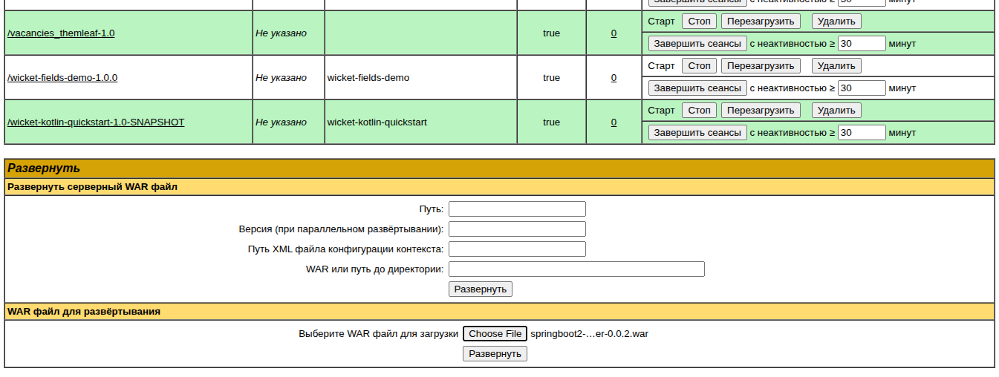

### Заготовка для UI проектов со Spring Boot Web

Java 17:

````shell
export JAVA_HOME=/usr/lib/jvm/java-1.17.0-openjdk-amd64
````

URL для разработки [http://127.0.0.1:8088/hr_admin/employees/](http://127.0.0.1:8088/hr_admin/employees/)

Основная цель __ТОЛЬКО FRONTEND__.

- В качестве template использован __Freemarker__ (__spring-boot-starter-freemarker__).
- Простой CRUD. База данных __H2__.
- Использован __Tailwind__ - CSS-фреймворк для оформления интерфейсов.
- При тестировании использован __AssertJ__.
- Использован __GigaChat__.
- тесты в __BDD__ стиле с __Mockito__ в EmployeeControllerTest.java
- __DataJpaTest__ в EmployeeRepositoryTest.java

Основной экран в виде карточек:



Список сотрудников в виде таблицы с сортировкой и СВЕРНУТОЙ панелью:



Список сотрудников в виде таблицы с сортировкой и РАЗВЕРНУТОЙ панелью:



Диалог ввода сотрудника:



Диалог изменение данных сотрудника:



Список должностей:



Редактирование должности:



### Создание maven wrapper

````shell
mvn -N wrapper:wrapper -Dmaven=3.9.9
````

````shell
./mvnw --version
````

````text
Apache Maven 3.9.9 (8e8579a9e76f7d015ee5ec7bfcdc97d260186937)
Maven home: /home/vasi/.m2/wrapper/dists/apache-maven-3.9.9/3477a4f1
Java version: 17.0.17, vendor: Ubuntu, runtime: /usr/lib/jvm/java-17-openjdk-amd64
Default locale: en_US, platform encoding: UTF-8
OS name: "linux", version: "6.14.0-37-generic", arch: "amd64", family: "unix"

````
### ModelAndView

В стандартном подходе Spring Boot Web должны возвращаться __ModelAndView__:

````java
import org.springframework.http.HttpStatus;
import org.springframework.web.bind.annotation.GetMapping;
import org.springframework.web.servlet.ModelAndView;

@Controller
@RequestMapping("catalog/products")
public class ProductController {
    
    @GetMapping("list")
    ModelAndView list() {
        return new ModelAndView("catalog/products/list", 
            Map.of("products", this.productRepository.findAll()), 
            HttpStatus.OK);
    }
}
````

В этом проекте возвращаются имена __view__. 

````java
	@RequestMapping(value = "/employees/new", method = RequestMethod.GET)
	public String showCreateForm(Model model) {
		log.info("showCreateForm");
		model.addAttribute("employee", new Employee());
		model.addAttribute("positions", positionRepository.findAll());
		log.info("/employees/new: from page={}", currentIndexPage);
		return "create_employee"; // имя template из src/main/resources/templates
	}
````


При этом подходе есть особенности тестирования. Пример:

````java
    @Test
    public void shouldShowEditFormForExistingEmployee() throws Exception {
        // Given
        Position position = new Position(1L, "Developer");
        Employee employee = new Employee("John", "Doe", "john.doe@example.com", position);
        employee.setId(1L);

        given(employeeRepository.findById(1L)).willReturn(Optional.of(employee));
        given(positionRepository.findAll()).willReturn(List.of(position));

        // When & Then
        mockMvc.perform(get("/employees/edit/1"))
                .andExpect(status().isOk())
                .andExpect(view().name("edit_employee"))
                .andExpect(model().attributeExists("employee", "positions"))
                .andExpect(model().attribute("employee", employee));
    }
````

### Тестирование

````shell
./mvnw clean test
````

Подключен плагин JaCoCo report для создания отчета покрытия тестами.

Для генерации отчета выполнить:

````shell
./mvnw jacoco:report
````

Отчет в [target/site/jacoco/index.html](target/site/jacoco/index.html).

### Сборка

````shell
./mvnw clean package
````

Собранный __FAT__ jar будет в target/hr-admin-0.0.3.jar

Использован __org.springframework.boot:spring-boot-maven-plugin__ .

### Запуск

````shell
 /usr/lib/jvm/java-1.17.0-openjdk-amd64/bin/java -jar target/hr-admin-0.0.3.jar
````

Запуск на другом порту:

````shell
/usr/lib/jvm/java-1.17.0-openjdk-amd64/bin/java -jar target/hr-admin-0.0.3.jar --server.port=8088
````

### Использование

Открыть [http://127.0.0.1:8088/hr_admin/employees/](http://127.0.0.1:8088/hr_admin/employees/)

(см. application.yaml)

Для запуска выполнить на v.perm.ru:

````shell
/usr/lib/jvm/java-17-openjdk-amd64/bin/java -jar ./hr-admin-0.0.3.jar  --server.port=8088
````

Открыть [https://v.perm.ru:8088/](https://v.perm.ru:8088/)
(проверено 29/03/26 на компе Игоря. Открывается с предупреждением о сертификате.)

### Размещение на tomcat сервере

Сборка:

````shell
./mvnw clean package -DskipTests
````

Полученный файл target//springboot2-freemarker-0.0.2.war задеплоить в Tomcat через панель управления Tomcat.



Доступ [http://v.perm.ru:8088/](http://v.perm.ru:8088/)

не HTTPS!

### HTTPS

Размещено на [https://v.perm.ru/hr_admin/employees/](https://v.perm.ru/hr_admin/employees/)

Работа через HTTPS сделана с помощью проксирования через apache2:

````text
root@v:/etc/apache2/sites-enabled# cat 000-default-le-ssl.conf 
<IfModule mod_ssl.c>
    <VirtualHost *:443>
	ServerName v.perm.ru

	ServerAdmin vasi.che@gmail.com
	DocumentRoot /var/www/main/

	LogLevel debug

	ErrorLog ${APACHE_LOG_DIR}/error.log
	CustomLog ${APACHE_LOG_DIR}/access.log combined

    # Настройка HTTPS для Apache2
	SSLEngine on
	
	SSLCertificateFile /etc/letsencrypt/live/v.perm.ru/cert.pem
	SSLCertificateChainFile /etc/letsencrypt/live/v.perm.ru/fullchain.pem
	SSLCertificateKeyFile /etc/letsencrypt/live/v.perm.ru/privkey.pem
	SSLCACertificateFile /etc/letsencrypt/live/v.perm.ru/chain.pem
	Include /etc/letsencrypt/options-ssl-apache.conf

	# Проксирование запросов для Spring Boot приложения hr_admin (работает по HTTP на localhost:8088)
	ProxyPreserveHost On
	ProxyPass /hr_admin http://192.168.1.20:8088/hr_admin
	ProxyPassReverse /hr_admin http://192.168.1.20:8088/hr_admin
	# Передача информации о протоколе (важно для Spring Boot)
	RequestHeader set X-Forwarded-Proto https

	# Дополнительные настройки безопасности и логирования
	Protocols h2 http/1.1
	SSLProtocol all -SSLv3 -TLSv1 -TLSv1.1
	ErrorLog ${APACHE_LOG_DIR}/spring-proxy-error.log
	CustomLog ${APACHE_LOG_DIR}/spring-proxy.log combined
    </VirtualHost>
</IfModule>
````

В приложении никаких настроек на HTTPS __нет__.

В [doc/https/](doc/https/) другая (неудавшаяся) настройка на HTTPS. Через __Apache proxy__ настройка проще. 

### Разное

SQL запросы логируются. Для этого сделена настройка:

````text
spring.jpa.show-sql=true
spring.jpa.properties.hibernate.format_sql=true
````

Не переносить слова __whitespace-nowrap__: 

````text
<span class="ml-3 whitespace-nowrap">Скрыть панель</span>
````

В контроллерах использовать __RequestMapping__ вместо __GetMapping__. Почему? 
Потому что здесь не простой REST Controller, а управление страницами. Методы те же, но нужна дополнительная функциональность типа "redirect". 

### О Freemarker

[https://habr.com/ru/articles/420549/](https://habr.com/ru/articles/420549/)

#### Пример 1:

````html
<ul>
  <#list father as item>
      <li>${item}</li>
  </#list>
</ul>
````

````java
Map<String, Object> root = new HashMap<>();
....
root.put("father", Arrays.asList("Alexander", "Petrov", 47));
````


#### Пример 2:

Шаблон hello_test.ftl:

````html
<!DOCTYPE html>
<html lang="en">
<head>
    <meta charset="UTF-8">
    <title>Hello ${name}!</title>
</head>
<body>

<input type="text" placeholder="${name}">

<table>
    <#list persons as row>
    <tr>
        <#list row as field>
            <td>${field}</td>
        </#list>
    </tr>
    </#list>
</table>

</body>
</html>

````

````java
@Component
public class CommandLine implements CommandLineRunner {

    @Autowired
    private Configuration configuration;

    public void run(String... args) {
        Map<String, Object> root = new HashMap<>();
        // для ${name}
        root.put("name", "Fremarker");
        // для <#list persons
        List<List> persons = new ArrayList<>();
        persons.add(Arrays.asList("Alexander", "Petrov", 47));
        persons.add(Arrays.asList("Slava", "Petrov", 13));
        root.put("persons", persons);

        try {
            Template template = configuration.getTemplate("hello_test.ftl");
            Writer out = new OutputStreamWriter(System.out);
            try {
                template.process(root, out);
            } catch (TemplateException e) {
                e.printStackTrace();
            }
        } catch (IOException e) {
            e.printStackTrace();
        }
    }
}
````

Результат:

````html
<!DOCTYPE html>
<html lang="en">
<head>
    <meta charset="UTF-8">
    <title>Hello Fremarker!</title>
</head>
<body>

<input type="text" placeholder="Fremarker">

<table>
    <tr>
            <td>Alexander</td>
            <td>Petrov</td>
            <td>47</td>
    </tr>
    <tr>
            <td>Slava</td>
            <td>Petrov</td>
            <td>13</td>
    </tr>
</table>
</body>
````

### Макросы:

#### Пример 1
Объявление макроса __textInput__ в файле __"ui.ftl"__:

````html
<#macro textInput id value="-">
  <input type="text" id="${id}" value="${value}">
</#macro>
````
Ключевое слово __<#macro>__ , __</#macro>__.
__textInput__ имя макроса.
__id__ и __value__ - параметры макроса (value="-" - значение по умолчанию).

Подключение макроса через __import__:
(ключевое слово __#import__)

````html
<#import "ui.ftl" as ui/>
````
"ui" - алиас для использования.

В шаблоне макрос "textInput" из импорта "ui" вызывается так:

````html
<@ui.textInput id="name" value="${name}"/>
````

### Пример 2:

Файл макрос__ОВ__ __ui.ftl__:

````html
<#-- textInput macro for html input -->
<#macro textInput id placeholder="" value="">
  <input type="text" id="${id}" placeholder="${placeholder}" value="${value}">
</#macro>

<#-- table macro for html table -->
<#macro table id rows>
<table id="${id}">
    <#list rows as row>            <#-- ЦИКЛ!!! -->                   
    <tr>
        <td>${row?index + 1}</td>  <#-- ВЫЧИСЛЕНИЕ!!! -->
        <#list row as field>       <#-- ЦИКЛ!!! -->
            <td>${field}</td>
        </#list>
    </tr>
    </#list>
</table>
</#macro>
````

Использование __ui.ftl__ в __hello.ftl__:

````html
<#import "ui.ftl" as ui/>

<!DOCTYPE html>
<html lang="en">
<head>
    <meta charset="UTF-8">
    <title>Hello ${name}!</title>
</head>
<body>

<@ui.textInput id="name" placeholder="Enter name" value="${name}"/>
<@ui.table id="table1" rows=persons/>

</body>
</html>
````

### HTTPS

````shell
keytool -genkeypair -alias tomcat -keyalg RSA -keystore keystore.p12 -storetype PKCS12 -validity 365 -storepass changeit
````

````shell
$ keytool -genkeypair -alias tomcat -keyalg RSA -keystore keystore.p12 -storetype PKCS12 -validity 365 -storepass changeit
Enter the distinguished name. Provide a single dot (.) to leave a sub-component empty or press ENTER to use the default value in braces.
What is your first and last name?
[Unknown]:  Cherepakhin
What is the name of your organizational unit?
[Unknown]:  Vasili OU       
What is the name of your organization?
[Unknown]:  Vasili Organization
What is the name of your City or Locality?
[Unknown]:  Perm
What is the name of your State or Province?
[Unknown]:  Perm
What is the two-letter country code for this unit?
[Unknown]:  RU
Is CN=Cherepakhin, OU=Vasili OU, O=Vasili Organization, L=Perm, ST=Perm, C=RU correct?
[no]:  yes

Generating 3072-bit RSA key pair and self-signed certificate (SHA384withRSA) with a validity of 365 days
for: CN=Cherepakhin, OU=Vasili OU, O=Vasili Organization, L=Perm, ST=Perm, C=RU
````

Создастся файл ./keystore.p12 
Сохраните его в src/main/resources:

````shell
cp keystore.p12 src/main/resources
````

Добавьте настройки в application.yaml.
````yaml
# Включить HTTPS
server:
  port: 8443
  ssl:
    key-store: classpath:keystore.p12
    key-store-password: changeit
    key-store-type: PKCS12
    key-alias: tomcat
````
Пароль не вводил.

Информация о сертификате при запуске с v.perm.ru [https://www.misterpki.com/keytool-list-certs/](https://www.misterpki.com/keytool-list-certs/):

````text
Common Name (CN)	Cherepakhin
Organization (O)	Vasili Organization
Organizational Unit (OU)	Vasili OU
Common Name (CN)	Cherepakhin
Organization (O)	Vasili Organization
Organizational Unit (OU)	Vasili OU
Issued On	Wednesday, April 1, 2026 at 10:15:07PM
Expires On	Thursday, April 1, 2027 at 10:15:07PM
````

Просмотр keystore:

````shell
$ cat https.sh 
$ keytool -list -keystore src/main/resources/keystore.p12
Enter keystore password: нет пароля

*****************  WARNING WARNING WARNING  *****************
* The integrity of the information stored in your keystore  *
* has NOT been verified!  In order to verify its integrity, *
* you must provide your keystore password.                  *
  *****************  WARNING WARNING WARNING  *****************

Keystore type: PKCS12
Keystore provider: SUN

Your keystore contains 1 entry

Alias name: tomcat
Creation date: Apr 3, 2026
Entry type: PrivateKeyEntry
Certificate chain length: 0

````

````shell
keytool -list -v -alias tomcat -keystore src/main/resources/keystore.p12
pass: пусто

Alias name: tomcat
Creation date: Apr 3, 2026
Entry type: PrivateKeyEntry
Certificate chain length: 0
````

````shell
$ openssl s_client -connect v:443 -showcerts
CONNECTED(00000003)
Can't use SSL_get_servername
depth=2 C = US, O = Internet Security Research Group, CN = ISRG Root X1
verify return:1
depth=1 C = US, O = Let's Encrypt, CN = E7
verify return:1
depth=0 CN = v.perm.ru
verify return:1
---
Certificate chain
 0 s:CN = v.perm.ru
   i:C = US, O = Let's Encrypt, CN = E7
   a:PKEY: id-ecPublicKey, 256 (bit); sigalg: ecdsa-with-SHA384
   v:NotBefore: Feb 16 16:24:34 2026 GMT; NotAfter: May 17 16:24:33 2026 GMT
-----BEGIN CERTIFICATE-----
....
-----END CERTIFICATE-----

1 s:CN = v.perm.ru
   i:C = US, O = Let's Encrypt, CN = E7
   a:PKEY: id-ecPublicKey, 256 (bit); sigalg: ecdsa-with-SHA384
   v:NotBefore: Feb 16 16:24:34 2026 GMT; NotAfter: May 17 16:24:33 2026 GMT
-----BEGIN CERTIFICATE-----
....
-----END CERTIFICATE-----
 2 s:C = US, O = Let's Encrypt, CN = E7
   i:C = US, O = Internet Security Research Group, CN = ISRG Root X1
   a:PKEY: id-ecPublicKey, 384 (bit); sigalg: RSA-SHA256
   v:NotBefore: Mar 13 00:00:00 2024 GMT; NotAfter: Mar 12 23:59:59 2027 GMT
-----BEGIN CERTIFICATE----
....
-----END CERTIFICATE-----
---
Server certificate
subject=CN = v.perm.ru
issuer=C = US, O = Let's Encrypt, CN = E7
...
````

От gigachat:

````text
Запрос:
Работает https сервер apache2 на linux. Есть доступ к нему по https. Есть cert.pem  chain.pem  fullchain.pem  keystore.p12  privkey.pem. Нужно запустить spring boot приложение на этом сервере. Какие настройки нужно сделать в application.yaml этого приложения?

Ответ:
Для запуска Spring Boot-приложения по HTTPS с использованием ваших сертификатов и ключей, настройки в application.yaml будут следующими.

Пример конфигурации для application.yaml

server:
  port: 8443 # или любой другой порт, который вы хотите использовать
  ssl:
    enabled: true
    key-store: /path/to/keystore.p12
    key-store-type: PKCS12
    key-store-password: your_keystore_password # укажите пароль от keystore.p12
    key-alias: your_key_alias # если есть, иначе можно не указывать
Пояснения
key-store: путь к вашему файлу keystore.p12.
key-store-type: тип хранилища ключей. Для .p12 — это PKCS12.
key-store-password: пароль для доступа к keystore.
key-alias: псевдоним ключа внутри keystore (если он есть, иначе можно не указывать).
Если вы хотите использовать отдельные файлы (privkey.pem и fullchain.pem)
Spring Boot также поддерживает конфигурацию через отдельные файлы ключа и сертификата:

server:                 <----- МОЙ ВАРИАНТ
  port: 8443
  ssl:
    enabled: true
    key-store-type: PKCS12
    key-store: /path/to/keystore.p12
    key-store-password: your_keystore_password

# Либо так, если не используете keystore: 
# server:
#   ssl:
#     key-store-type: PKCS12
#     key-store: classpath:keystore.p12
#     key-store-password: your_keystore_password

# Или для отдельных файлов (Spring Boot 2.2+):
# server:
#   ssl:
#     key-store-type: PEM
#     ssl-certificate: file:/path/to/fullchain.pem
#     ssl-key: file:/path/to/privkey.pem
Важно: поддержка отдельных PEM-файлов появилась в Spring Boot 2.2+. Если у вас более старая версия, используйте только keystore.

Рекомендация
Если у вас уже есть keystore.p12, лучше использовать его, так как это наиболее универсальный и поддерживаемый способ для Spring Boot.
````

4. Запустите приложение

Теперь доступно по: [https://<IP computer>:8443](https://192.168.1.79:8443)

Если хотите, чтобы HTTP → перенаправлялся на HTTPS, добавьте конфигурацию:
SecurityConfig.java:

````java
package net.guides.springboot2.freemarker.config;

import org.springframework.context.annotation.Bean;
import org.springframework.context.annotation.Configuration;
import org.springframework.security.config.annotation.web.builders.HttpSecurity;
import org.springframework.security.config.annotation.web.configuration.EnableWebSecurity;
import org.springframework.security.web.SecurityFilterChain;
import org.springframework.security.web.util.matcher.AntPathRequestMatcher;

@Configuration
@EnableWebSecurity
public class SecurityConfig {

    @Bean
    public SecurityFilterChain filterChain(HttpSecurity http) throws Exception {
        http
            .requiresChannel(channel -> channel
                .requestMatchers(AntPathRequestMatcher.antMatcher("/secure/**"))
                .requiresSecure()
            )
            .authorizeHttpRequests(authz -> authz
                .anyRequest().permitAll()
            )
            .portMapper(mapper -> mapper
                .http(8080).mapsTo(8443)
            );
        return http.build();
    }
}
````

### Перенаправление трафика через apache2
000-default-le-ssl.conf:
````text
<IfModule mod_ssl.c>
    <VirtualHost *:443>
	# The ServerName directive sets the request scheme, hostname and port that
	# the server uses to identify itself. This is used when creating
	# redirection URLs. In the context of virtual hosts, the ServerName
	# specifies what hostname must appear in the request's Host: header to
	# match this virtual host. For the default virtual host (this file) this
	# value is not decisive as it is used as a last resort host regardless.
	# However, you must set it for any further virtual host explicitly.
	ServerName v.perm.ru

	ServerAdmin vasi.che@gmail.com
	DocumentRoot /var/www/main/

	# Available loglevels: trace8, ..., trace1, debug, info, notice, warn,
	# error, crit, alert, emerg.
	# It is also possible to configure the loglevel for particular
	# modules, e.g.
	LogLevel debug

	ErrorLog ${APACHE_LOG_DIR}/error.log
	CustomLog ${APACHE_LOG_DIR}/access.log combined

	# For most configuration files from conf-available/, which are
	# enabled or disabled at a global level, it is possible to
	# include a line for only one particular virtual host. For example the
	# following line enables the CGI configuration for this host only
	# after it has been globally disabled with "a2disconf".
	#Include conf-available/serve-cgi-bin.conf

	#ServerName v.perm.ru
	SSLEngine on
	
	#SSLProxyEngine On
	#ProxyPreserveHost on
	#ProxyRequests off
	
	SSLCertificateFile /etc/letsencrypt/live/v.perm.ru/cert.pem
	#SSLCertificateFile /etc/letsencrypt/live/v.perm.ru/cert.pem
	SSLCertificateChainFile /etc/letsencrypt/live/v.perm.ru/fullchain.pem
	SSLCertificateKeyFile /etc/letsencrypt/live/v.perm.ru/privkey.pem
	SSLCACertificateFile /etc/letsencrypt/live/v.perm.ru/chain.pem
	Include /etc/letsencrypt/options-ssl-apache.conf

	# Проксирование запросов на Spring Boot (работает по HTTP на localhost:8088)
	ProxyPreserveHost On
	ProxyPass /hr_admin http://192.168.1.20:8088
	ProxyPassReverse /hr_admin http://192.168.1.20:8088
	# Передача информации о протоколе (важно для Spring Boot)
	RequestHeader set X-Forwarded-Proto https

	# Дополнительные настройки безопасности и логирования
	Protocols h2 http/1.1
	SSLProtocol all -SSLv3 -TLSv1 -TLSv1.1
	ErrorLog ${APACHE_LOG_DIR}/spring-proxy-error.log
	CustomLog ${APACHE_LOG_DIR}/spring-proxy.log combined
    </VirtualHost>

````

### Ссылки

[FreeMarker шаблоны (habr)](https://habr.com/ru/articles/420549/)
[Альтернатива Freemarker - Velocity](https://velocity.apache.org/).

### Примечания

<div class="rounded-md"> - скругленный углы
class="flex-1" - класс в Tailwind CSS, который позволяет элементу занимать равную долю доступного пространства в контейнере Flexbox.

При тестировании с mock, если используется any...(), то остальные поля должны быть заданы в виде типа eq(...)
Пример:

````java
verify(this.employeeRepository, times(1)).findByFiltersAndSort(eq("firstName1"), eq("lastName1"), eq("email1"), any());
````

[SVG иконки (пример стрелки вниз)](https://svgicons.com/icon/180/arrow-down)
[SVG иконки (пример стрелки влево)](https://svgicons.com/icon/187/arrow-left)


````text
<svg xmlns="http://www.w3.org/2000/svg" width="24" height="24" viewBox="0 0 24 24"><title>Arrow-down SVG Icon</title><path fill="none" stroke="currentColor" stroke-linecap="round" stroke-linejoin="round" stroke-width="2" d="M12 20V4m-7 9l7 7l7-7"/></svg>
````

### Стили

- py-2 = padding 8 px (*4)
- px-3 = padding 12 px (*4)
- mb-2 = margin buttom 8 px (*4)
- w-full - растянуть на всю доступную ширину
- max-w-6xl - определение максимальной ширины
- justify-center - динамическое центрирование по вертикали
- justify-end - прижать к правому краю

### TODO

Мелкий шрифт на пагинации на телефоне.

Шрифты [https://tailwindcss.com/docs/font-size](https://tailwindcss.com/docs/font-size).
